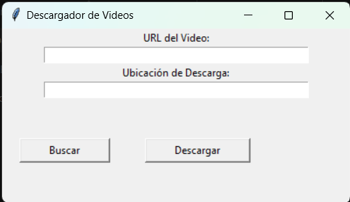

# DownloadVideo

Este proyecto lo hice practicar python con la api de youtube este proyecto sirve para descargar videos desde youtube

## Usage 🚀

~ Descarga y installa python en tu computadora

```
https://www.python.org/
```

~ Clona el repositorio

```
git clone https://github.com/luisangelponcealvarez/DownloadVideo.git
```

~ Instala los paquetes nesesarios

- la libreria tkinter sirve para hacer la ventana
  ```
  pip install tkinter
  ```
- la libreria pythube sirve para la api de youtube para sacar los videos
  ```
  pip install pytube
  ```

~ Para ejecutar el programa ejecuta el siguiente comando

```
py DownloadVideosYouTube.py
```

## Miniatura


